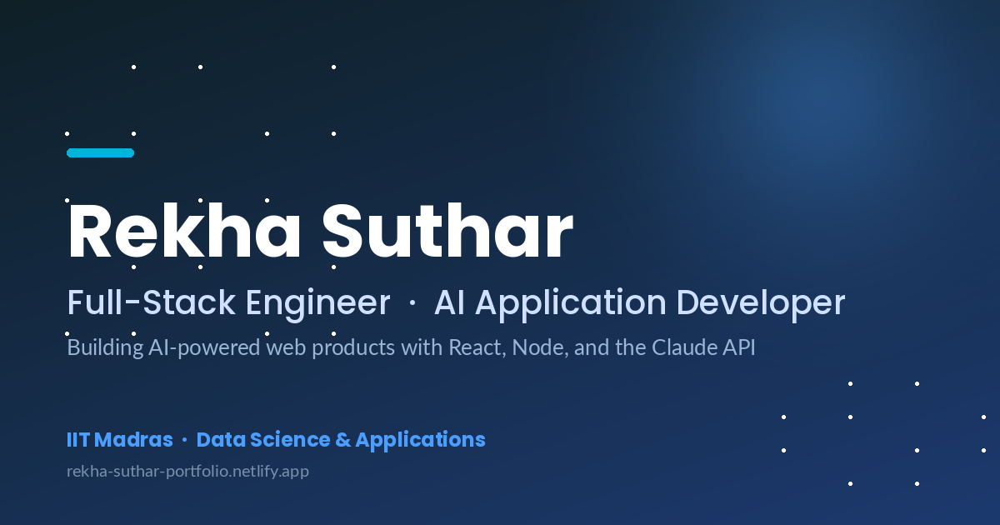

# Rekha Suthar — Portfolio



Personal portfolio for **Rekha Suthar** — full-stack engineer with a Data Science background from IIT Madras, building AI-powered web products end to end with React, Node, and the Claude / Groq API.

🔗 **Live**: [rekha-suthar-portfolio.netlify.app](https://rekha-suthar-portfolio.netlify.app/)

---

## What's on the site

| Section | Purpose |
|---|---|
| **Home** | Hero with a typewriter-rotated job-title strip + social + résumé link. |
| **About** | Short bio, journey cards, current focus. |
| **Now** | *Currently Building* — projects actively in progress, with status pills + live demo + repo links. |
| **Education** | B.Sc. Data Science & Applications, IIT Madras + upGrad FSD Bootcamp. |
| **Experience** | Vertical timeline of roles. |
| **Projects** | Curated full-stack work with live demos + GitHub. |
| **Writing** | Short build notes I publish on [dev.to](https://dev.to/rekha0suthar). |
| **Skills** | Frontend, backend, AI/ML, data tooling. |
| **Certificates** | HackerRank SQL, Outskill GenAI, upGrad FSD, Web Dev Hackathon. |
| **Contact** | EmailJS-powered contact form. |

---

## Tech stack

- **React 18** + **Create React App** (production build deployed via Netlify)
- **Framer Motion** for entrance animations
- **react-tsparticles** for the hero particles background
- **react-vertical-timeline-component** for the Experience timeline
- **react-simple-typewriter** for the rotating job titles
- **EmailJS** for the contact form (no backend required)
- **react-icons** for the skills grid

All content lives in a **single data file** at [`src/data/index.js`](src/data/index.js) — to refresh the site, edit one file. Components only render UI.

---

## Architecture — one data file, lean components

The codebase intentionally separates **data** from **presentation**:

```
src/
├── data/
│   └── index.js          ← Single source of truth for ALL content
│                            (personal, navLinks, about, currentlyBuilding,
│                             writings, education, experiences, projects,
│                             skills, certificates)
├── components/
│   ├── Home.jsx          ← Each section is a focused component that
│   ├── About.jsx           imports only the data it needs
│   ├── Now.jsx
│   ├── Education.jsx
│   ├── Experience.jsx
│   ├── Projects.jsx
│   ├── Writing.jsx
│   ├── Skills.jsx
│   ├── Certificates.jsx
│   ├── Contact.jsx
│   ├── Navbar.jsx
│   ├── Footer.jsx
│   └── ParticlesBackground.jsx
└── styles/                ← One CSS file per component
```

Want to add a new project, a new "Currently Building" entry, a new writing post, or update your bio? Open `src/data/index.js`, edit the relevant export, save, push. The whole site updates.

---

## Run locally

You'll need [Node 18+](https://nodejs.org/).

```bash
git clone https://github.com/rekha0suthar/rekha-portfolio.git
cd rekha-portfolio
npm install
npm start
```

Open http://localhost:3000.

**Optional environment variables** (for the Contact form's EmailJS integration — create a `.env` file at the repo root):

```env
REACT_APP_SERVICE_ID=...
REACT_APP_NOT_EMAIL_TEMPLATE_ID=...
REACT_APP_CONF_EMAIL_TEMPLATE_ID=...
REACT_APP_PUBLIC_KEY=...
```

Without these the form renders fine; submissions just no-op.

---

## Deploy

Hosted on **Netlify** with automatic GitHub deploys — every push to `main` triggers a rebuild.

```bash
npm run build   # produces /build
```

---

## Companion projects

- **[AI Resume Tailor](https://github.com/rekha0suthar/ai-resume-tailor)** ([live demo](https://ai-resume-tailor-ruby.vercel.app/)) — paste a resume + JD, get tailored bullet rewrites, ATS keyword gaps, and likely interview questions. Built on Groq Llama 3.3 70B + Vercel Functions.
- **[Grocery Store](https://github.com/rekha0suthar/grocery-store)** — MERN e-commerce with role-based access for customers, admins, and store managers.
- **[FinScope](https://github.com/rekha0suthar/budget_tracker)** — full-stack budgeting app with chart-based spending insights.

---

## Writing

Build notes published as I ship each project:

- [Building AI Resume Tailor — v0 build notes](https://dev.to/rekha0suthar/building-ai-resume-tailor-v0-build-notes-58f9)
- [Role-based access in a MERN e-commerce app](https://dev.to/rekha0suthar/role-based-access-in-a-mern-e-commerce-app-p0e)

Drafts live in [`writings/`](writings/) before publishing.

---

## Contact

- **LinkedIn**: [linkedin.com/in/rekha0suthar](https://www.linkedin.com/in/rekha0suthar/)
- **GitHub**: [@rekha0suthar](https://github.com/rekha0suthar)
- **Email**: rekha0suthar@gmail.com
- **Location**: Bangalore, Karnataka, India

Open to **Full-Stack SWE** and **AI Application Engineer** roles.

---

## License

MIT — fork it, use it as a template for your own portfolio.
